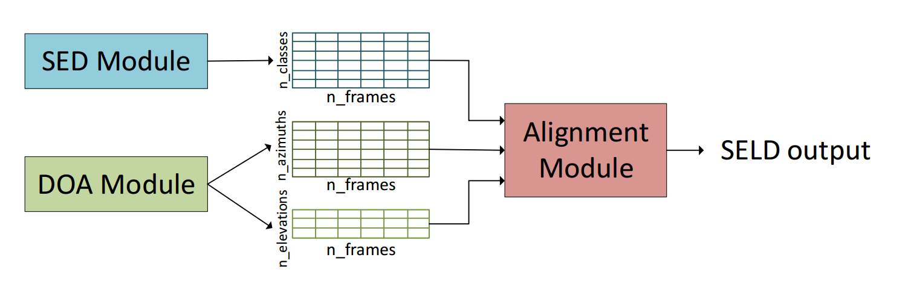
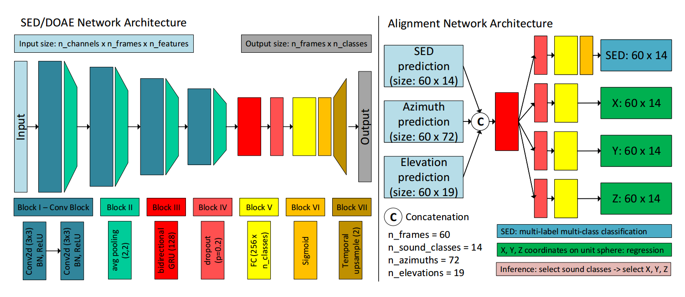

# General-network-architecture-for-sound-event-localization-and-detection
This repository contains code for our paper: **A General Network Architecture for Sound Event Localization and Detection Using Transfer Learning and Recurrent Neural Network**. 
Link to paper can be found [here](https://arxiv.org/abs/2011.07859) or in the *paper* folder.

We are sorry for uploading the code late. We are factoring our code using pytorch lightning to improve readability and reproducibility. 
Stay tuned.

## Task description
Sound event localization and detection (SELD) is an audio-related task that aims to detect onsets, offsets of sound events, estimate the directions-of-arrival of the sound sources, and recognize the sound classes.
SELD consists of two subtasks, which are sound event detection (SED) and direction-of-arrival (DOA) estimation. 
While SED and DOA estimation tasks are quite matured in audio field, 
SELD task is relatively new and getting more popular thanks to its appearance in the last two [DCASE2019](http://dcase.community/challenge2019/task-sound-event-localization-and-detection) and [DCASE202](http://dcase.community/challenge2020/task-sound-event-localization-and-detection) SELD challenge.

SELD is challenging because not only we need to solve two subtask SED and DOA estimation well, 
but also we need to match the correct directions with the correct sound classes. There are several approaches for SELD task. 
We can jointly estimate SED and DOA estimation in a single stage or we can solve SELD in several stages.
Conventional challenges of SED, DOA estimation, and SELD are noise, reveberation and overlapping sources.

Another big challenge of SELD is the lack of joint datasets. 
We have much larger datasets for single-channel sound classification such as [AudioSet](https://research.google.com/audioset/) or [FSD50K](https://annotator.freesound.org/fsd/release/FSD50K/). 
However, since the multi-channel datasets are restricted to some particular microphone array geometry, 
we do not have a big general datasets for DOA estimation. 
The current largest joint dataset for SELD task is simulated and limited to 13.3 hours. 

## Proposed method
We proposed a general and flexible network architecture for SELD as shown in the figures below. 

We decoupled the SED and DOA estimation task. 
An alignment module is used to align output predictions of the SED and DOA estimation module. 
The SED and DOA estimation modules are pretrained on their respectively task and can be fine-tuned again during the training of the alignment module.
The advantages of the proposed network architecture are:

1. It is easier to optimize SED and DOA estimation module separately as SED and DOA estimation relies on different form of audio input features. 

2. The model reduces unwanted association between sound classes and DOAs in the training set since SED and DOA estimation are pretrained separately.

3. The network architecture is highly practical:
    * It is more flexible to select different SED and DOA estimation algorithms that are suitable for specific application.
For example, lightweight algorithms are preferred for edge devices.
    * The SED module can use single-channel dataset instead of multi-channel dataset to leverage the much larger available datasets.
    * We can use both traditional signal processing-based or deep learning-based algorithms for the DOA estimation. 
      The signal processing-based methods do not required training data.
    * The required joint dataset to train the alignment module can be much smaller than the required joint dataset to train the whole SELD network end-to-end.
    

An example of network architectures of each module are shown below.

## Dataset

## Experimental Results

## How to use the provided code
The python code was implemented using Python 3.7
### Requirements

### Download data and pretrained model

### Running Scripts

## Citation

## License

## External links

